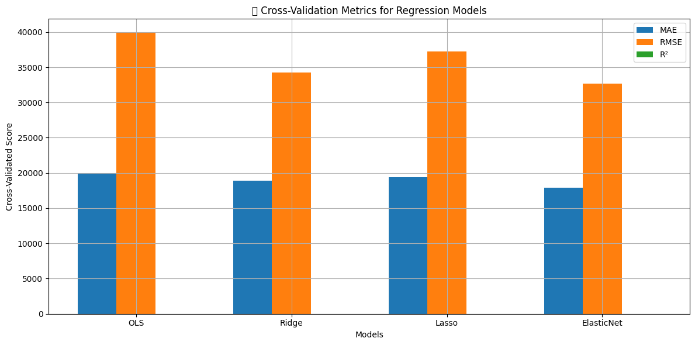
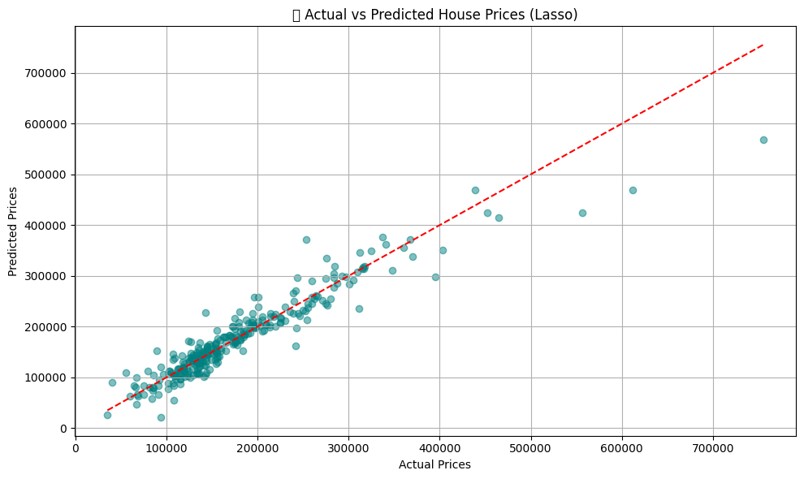

Absolutely, Lord Nag 👑. Here's the **complete, dark-themed, shield-powered, visual README** for your `HousePricePrediction` repo, fully enhanced for professional GitHub presence:

---

````markdown
# 🏡 House Price Prediction — A Full-Stack ML Regression Pipeline  
  
  
  
  
[](🟩 your-demo-link-here)

---

## 🎬 Dashboard Preview  
_A quick look at the deployed dashboard:_

| 📈 Cross-Validation Score Comparison     | 🎯 Actual vs Predicted (Lasso)         |
| ---------------------------------------- | ------------------------------------- |
|  |  |

---

## 🚀 Overview

> Predict house prices using **OLS**, **Ridge**, **Lasso**, and **ElasticNet** — fully pipelined, visualized, logged, and deployed using `streamlit` and `wandb`.

💥 _This is not just another notebook dump. This is industrial-grade ML engineering: logged, versioned, and deployed._

---

## 🧠 Models Implemented

| Model         | MAE       | RMSE      | R² Score |
| ------------- | ----------| ----------| ---------|
| **OLS**       | 18266.65  | 29557.71  | 0.8861   |
| **Ridge**     | 19106.48  | 29653.51  | 0.8854   |
| **Lasso** ✅  | 17971.00  | 28311.78  | **0.8955** |
| **ElasticNet**| 18638.18  | 31887.18  | 0.8674   |

All runs tracked with live visual dashboards on [Weights & Biases](https://wandb.ai/nagtamaghna-oxford-vision-and-sensor-technology/house-price-prediction)

---

## 📂 Folder Structure

```bash
HousePricePrediction/
├── data/                     # train.csv, test.csv
├── models/                   # lasso_model.pkl, submission.csv
├── results/                  # Plots and charts
│   ├── crossvalidationscores.png
│   └── lassoprediction.png
├── main.py                   # ML pipeline + wandb logging
├── app.py                    # Streamlit dashboard
├── requirements.txt
└── README.md
````

---

## ⚙️ Full Stack Used

| Layer            | Tools Used                                         |
| ---------------- | -------------------------------------------------- |
| 📊 Preprocessing | `pandas`, `sklearn.preprocessing`, `Pipeline`      |
| 🤖 Models        | `LinearRegression`, `Ridge`, `Lasso`, `ElasticNet` |
| 📈 Evaluation    | `MAE`, `RMSE`, `R²`, `cross_val_score`             |
| 🔬 Logging       | `wandb` (auto-track metrics + files)               |
| 📉 Visualization | `matplotlib`, `seaborn`                            |
| 🌐 UI/Dashboard  | `Streamlit`                                        |

---

## 🎯 Features in Action

### 📊 Model Training with Logging

```bash
python main.py
```

This:

* Trains all 4 regression models
* Evaluates using MAE, RMSE, R²
* Tracks metrics and plots via wandb
* Saves `lasso_model.pkl` for deployment

---

### 🌐 Interactive Dashboard

```bash
streamlit run app.py
```

The dashboard lets you:

* View model performance
* Visualize actual vs predicted prices
* Get predictions for test samples
* Explore metrics in real-time

---

## 📦 Requirements

```text
pandas
numpy
scikit-learn
matplotlib
seaborn
joblib
wandb
streamlit
```

---

## 🧪 Future Enhancements

* [ ] Add LightGBM & XGBoost regressors
* [ ] SHAP-based explainability
* [ ] Full CI/CD pipeline (GitHub Actions)
* [ ] Dockerize for production
* [ ] Deploy on Hugging Face Spaces

---

## 👨‍💻 Author

**Tamaghna Nag** (aka Lord Nag 👑)
📍 London | Kolkata
📫 [tamaghnanag04@gmail.com](mailto:tamaghnanag04@gmail.com)
🌐 [Portfolio](https://tamaghnatech.in)
🔗 [GitHub](https://github.com/Tamaghnatech)
🔗 [LinkedIn](https://www.linkedin.com/in/tamaghna99/)

---

## 🧠 Final Word

> *"ML isn’t just about training a model. It’s about managing complexity, curating data, logging progress, and shipping value."*

---

## ⭐ Like It? Star It!

If this repo saved you time or taught you something, show some love ⭐
Let’s elevate open-source ML engineering together!

```

